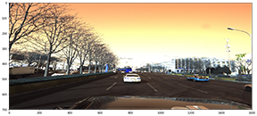
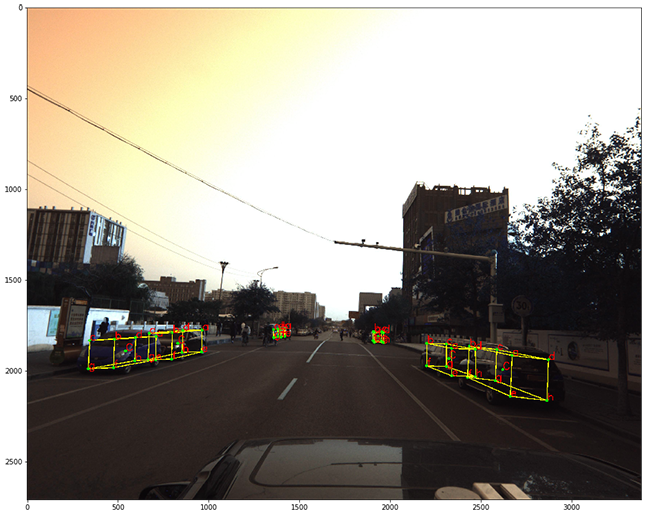

# Deep Learning -Peking University/Baidu - Autonomous Driving (Kaggle Competition-3D object detection):
Competition link : [click](https://www.kaggle.com/c/pku-autonomous-driving)

There are two general ideas: \
[**First is Center-point detections**]
 - **Detect Center point of each object (x, y in image) then regress its properties (X, Y, Z, Roll, Yaw, Pitch in 3Dworld)**\
 - First the masks will be generated by using the center point of each object from annotation (Ground Truth) as you can see in following pictures:\
 - center poitns:\

- imags and coresponding generated masks: [**Orginal Image , 1x Center Point Mask, 6x Regresion Masks**]\

- The following Struture is used to train the network:\

[**Second idea is Key-point detection (corners of the object 3d cube)**]
- First the masks will be generated by using the 3D corners of each object that can be calculated from annotation (Ground Truth) as you can see in following pictures:\

- In this method ve train the network to directly find 9 points for each object and then by using a post-processing method extract the object properties.
