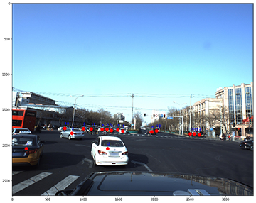
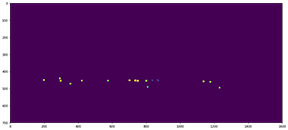

# Deep Learning -Peking University/Baidu - Autonomous Driving (Kaggle Competition-3D object detection):
Competition link : [click](https://www.kaggle.com/c/pku-autonomous-driving)

There are two general ideas:
 - **Detect Center point of each object (x, y in image) then regress its properties (X, Y, Z, Roll, Yaw, Pitch in 3Dworld)**\
 - First the masks will be generated by using the center point of each object from annotation (Ground Truth) as you can see in following pictures:\
 - center poitns:\

- imags and coresponding generated masks:\

